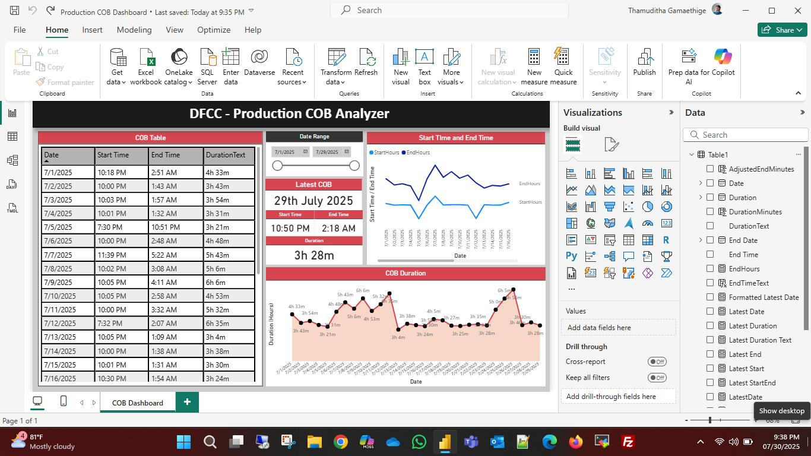

# COB Process Analyzer Dashboard

A Power BI dashboard case study for analyzing **Close of Business (COB)** process timing and duration using Excel-based data.

## Project Overview

This project was created during my internship as an additional improvement to make COB process details easier to monitor and analyze.

The original requirement was to maintain COB details in an Excel sheet, including the COB date, start time, end time, and duration. Instead of using only Excel, I created a simple Power BI dashboard to visualize the data more clearly and provide a quick summary of the COB process.

This dashboard helps users understand the latest COB status, identify duration changes, and review start and end time patterns over a selected date range.

## What is COB?

COB stands for **Close of Business**. In a banking environment, this is a process carried out at the end of each business day. The process has a start time, end time, and total duration.

Tracking these details helps teams understand whether the process is completing within expected time ranges and whether there are any unusual delays.

## Problem

The COB process details were maintained in Excel format. While Excel is useful for recording data, it was not very convenient for quickly understanding trends and key details.

The main challenges were:

- Difficult to quickly identify the latest COB date and duration
- Manual checking was needed to compare start and end times
- Duration trends were not clearly visible
- Harder to review historical COB performance at a glance
- No simple visual summary for monitoring purposes

## Solution

I created a Power BI dashboard using Excel as the data source. The dashboard converts the COB records into a simple visual report with key metrics, charts, and filters.

The dashboard allows users to quickly view:

- Latest COB date
- Latest start time
- Latest end time
- Latest COB duration
- COB duration trend
- Start time and end time trend
- Date-wise COB records

## Dashboard Preview

## Key Features

- COB data table with date, start time, end time, and duration
- Date range filtering
- Latest COB summary card
- Start time and end time trend visualization
- COB duration trend chart
- Duration calculation and formatting
- Excel-based data import
- Simple and readable dashboard layout

## Tools and Technologies Used

- Microsoft Power BI
- Microsoft Excel
- Data Cleaning
- Data Visualization
- Dashboard Design
- Basic Data Analysis

## Data Source

The dashboard was created using Excel-based COB records.

The dataset included fields such as:

- Date
- Start Time
- End Time
- End Date
- Duration

The Excel file was imported into Power BI and transformed into calculated fields such as duration text, duration minutes, start minutes, and adjusted end minutes for better visualization.

## Dashboard Components

### 1. COB Table

Displays daily COB records including date, start time, end time, and duration.

### 2. Date Range Filter

Allows users to filter the dashboard based on a selected date range.

### 3. Latest COB Summary

Shows the most recent COB date, start time, end time, and total duration.

### 4. Start Time and End Time Chart

Visualizes how the COB start and end times changed over time.

### 5. COB Duration Chart

Shows the duration trend of the COB process across different dates.

## Learning Outcome

Through this project, I gained practical experience in creating a simple Business Intelligence dashboard using Power BI and Excel.

This project helped me understand how raw operational data can be converted into useful visual insights for easier monitoring and reporting.

I also learned how to:

- Import Excel data into Power BI
- Create calculated columns and measures
- Design a simple dashboard layout
- Visualize time-based operational data
- Use charts, cards, tables, and filters
- Present data in a way that is easier for teams to understand

## Future Improvements

In the future, this dashboard can be improved by:

- Connecting directly to a database or data warehouse
- Automating data refresh
- Adding process status or error analysis
- Adding weekly and monthly trend summaries
- Creating KPI indicators for delayed COB processes
- Improving UI design and responsiveness
- Publishing the dashboard with scheduled refresh

## Project Type

This is a beginner-friendly Business Intelligence case study created using Power BI and Excel.

## Author

**Thamuditha Veenath Gamaethige**  
BSc (Hons) IT Graduate  
Interested in Software Development, Business Intelligence, Data Analytics, and IT Operations
